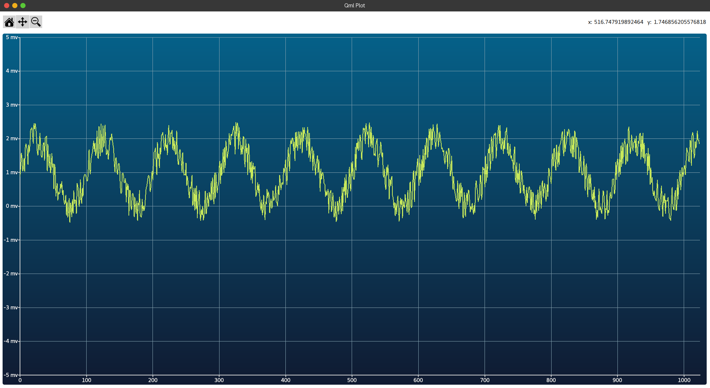
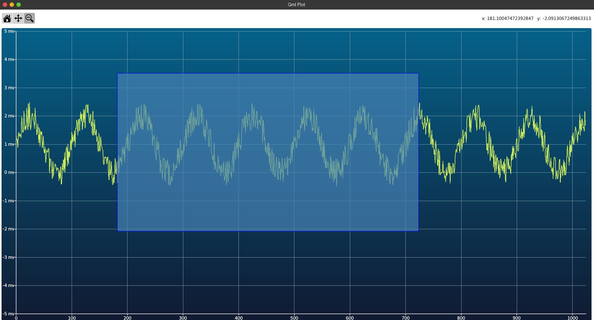

# Figure.qml

Figure.qml is a Qt Quick QML file that provides a graphical interface for a chart view. It includes functionalities for scrolling and zooming the chart view using keyboard keys and a reset button. This component is very similar to the matplotlib library in Python in terms of its functionality and usage.

## Features

1. **Keyboard Controls**: The chart view can be scrolled up, down, left, or right using the respective arrow keys on the keyboard.

2. **Mouse Controls**: The chart view supports mouse interactions for dragging and zooming.
    - Dragging: Left button pans and right button zooms x/y fixes axis.
    - Zooming: Left button zooms in to drawed rectangle and right button zooms out of it.

3. **Reset Button**: A button with a home icon is provided to reset the chart view to its original state.

## Properties

- `minX`, `maxX`: Define the horizontal range of the chart view.
- `minY`, `maxY`: Define the vertical range of the chart view.
- `mouseX`, `mouseY`: Store the current mouse coordinates.

## Usage

To use this component, import it into your QML file and instantiate it as needed. You can customize the properties as per your requirements.

## Dependencies

This component depends on the following Qt modules:

- QtQuick
- QtCharts
- QtQuick.Layouts
- QtQuick.Controls

Ensure these modules are available in your Qt environment.

## Similarities with Matplotlib

This component provides functionalities similar to the matplotlib library in Python. It provides a high-level interface for drawing attractive and informative statistical graphics.
